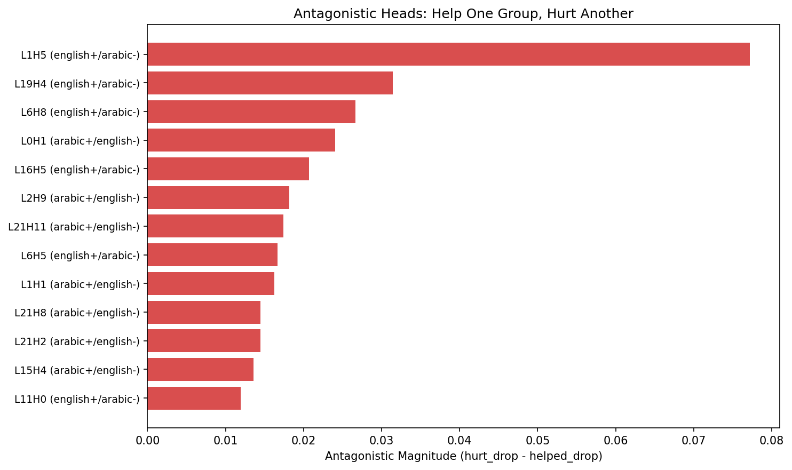
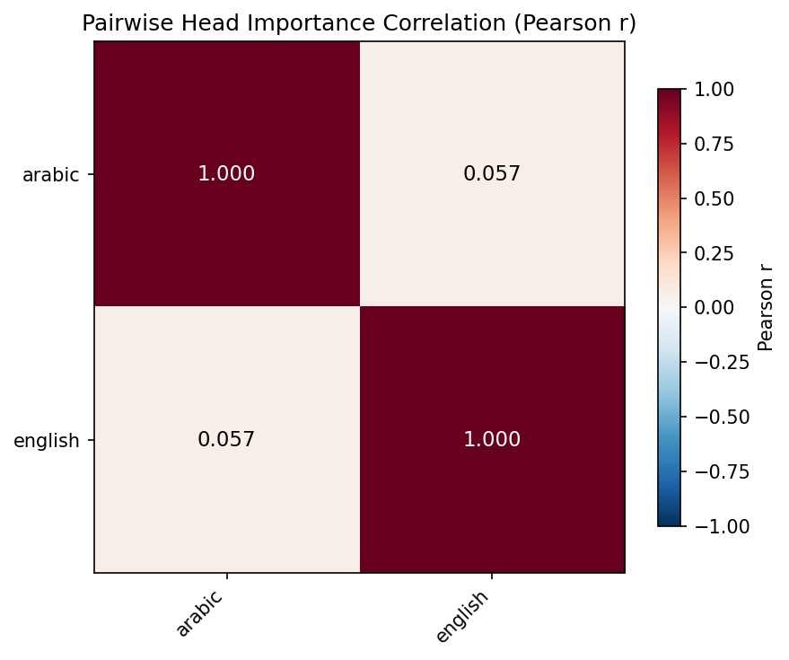
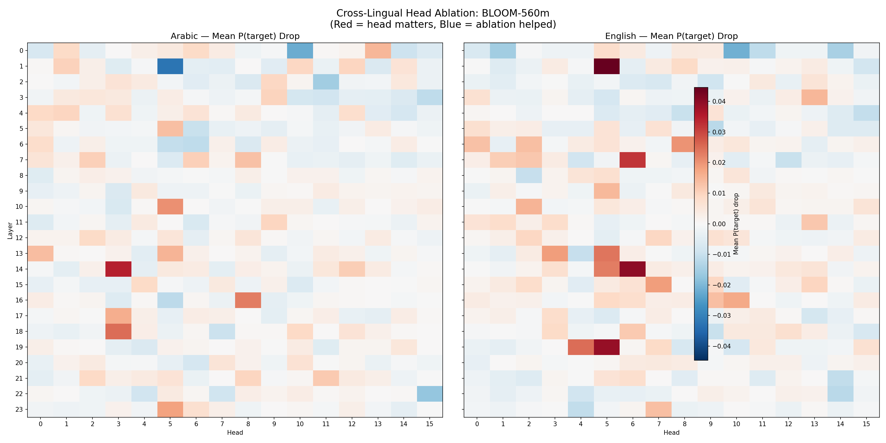

<div align="center">
<h2 align="center">
  <b>
    <span>━━━━━━━━━━━━━━━━━━━━━━━━━━━</span>
    <br/>
    Antagonistic Attention
    <br/>
    <span>━━━━━━━━━━━━━━━━━━━━━━━━━━━</span>
    <br/>
  </b>
</h2>
<p><b>Ahmad Al-Zaro</b></p>
</div>

<p align="center">
  <a href="paper.tex">Paper</a> &nbsp;|&nbsp;
  <a href="#overview">Overview</a> &nbsp;|&nbsp;
  <a href="#results">Results</a> &nbsp;|&nbsp;
  <a href="#reproduce">Reproduce</a> &nbsp;|&nbsp;
  <a href="#citation">Citation</a>
</p>

<p align="center">
  
</p>
<p align="center"><em>
  Antagonistic heads: L20H15 helps English (+1.946 logit drop) while hurting Arabic (−0.192), and L21H11 helps Arabic (+0.428) while hurting Hindi (−0.393) — preliminary mechanistic evidence for the curse of multilinguality.
</em></p>

---

This is the official repository for **Antagonistic Attention: Cross-Lingual Head Circuits in BLOOM-560m**, a cross-lingual mechanistic interpretability study applying four complementary techniques across six languages to factual recall in BLOOM-560m.

## Overview

Multilingual models achieve cross-lingual transfer from a fixed set of parameters, yet the circuit-level mechanisms behind this remain unexplored. We applied zero ablation, activation patching, directional edge attribution patching (EAP), and logit lens to 35 factual recall prompts across English, Arabic, French, Chinese, Hindi, and Japanese in BLOOM-560m (384 attention heads across 24 layers).

We find three phenomena:

- **Antagonistic heads** that causally help one language while hurting another — preliminary mechanistic evidence for the curse of multilinguality
- A small set of **multi-lingual heads** (L14H3, L16H8, L23H5) contributing positively across 5–6 languages
- **Language-dependent necessity–sufficiency dissociations**: the correlation between ablation impact and patching restoration ranges from r=0.65 (Hindi, p<0.001) to r=0.06 (French, n.s.)

All findings are specific to factual recall in BLOOM-560m and should be interpreted as preliminary.

### Four Interpretability Techniques

| Method | Measures | Key Finding |
|:---|:---|:---|
| **Zero Ablation** | Necessity | Identifies heads whose removal drops target logit |
| **Activation Patching** | Sufficiency | Measures how much each head can individually restore correct prediction |
| **Directional EAP** | Information flow | Push–pull edge structure consistent across all 6 languages |
| **Raw Logit Lens** | Convergence layer | English crystallizes at L21, Arabic/Hindi at L22, Chinese at L23 |

## Results

### Antagonistic Heads

Heads where ablation helps one language while hurting another, providing mechanistic evidence for zero-sum capacity trade-offs:

| Head | Helps | Hurts | Δ help | Δ hurt |
|:---|:---|:---|:---:|:---:|
| **L20H15** | English | Arabic | +1.946 | −0.192 |
| **L21H11** | Arabic | Hindi | +0.428 | −0.393 |
| **L18H15** | English | Arabic | +0.870 | −0.159 |
| **L22H14** | French | Japanese | +0.522 | −0.087 |
| **L23H12** | English | Hindi | +0.307 | −0.171 |

### Multi-Lingual Heads (≥4 languages)

| Head | n_L | en | ar | fr | zh | hi | ja |
|:---|:---:|:---:|:---:|:---:|:---:|:---:|:---:|
| **L14H3** | 6 | .174 | .335 | .145 | .063 | .084 | .161 |
| **L16H8** | 5 | .052 | .321 | .114 | .102 | — | .156 |
| **L20H6** | 4 | .792 | .051 | .153 | .237 | — | — |
| **L23H5** | 5 | — | .169 | .068 | .080 | .121 | .051 |

Values are average logit drop (Δ_abl). Dashes indicate Δ_abl ≤ 0.05 or negative.

### Necessity–Sufficiency Correlations

<p align="center">
  
</p>
<p align="center"><em>
  Necessity–sufficiency correlation between zero ablation and activation patching varies dramatically by language: r=0.652 for Hindi (significant after Bonferroni correction) vs r=0.055 for French (not significant).
</em></p>

| Language | Pearson r | p-value | Survives Bonferroni? |
|:---|:---:|:---:|:---:|
| Hindi | 0.652 | 9.6×10⁻⁵ | ✓ |
| Japanese | 0.362 | 0.049 | — |
| Chinese | 0.315 | 0.090 | — |
| English | 0.186 | 0.324 | — |
| Arabic | 0.161 | 0.394 | — |
| French | 0.055 | 0.771 | — |

### Cross-Lingual Heatmaps

<p align="center">
  
</p>
<p align="center"><em>
  Head importance heatmaps (layer × head) for each of the 6 languages. Color indicates average ablation logit drop — warm colors mark important heads, cool colors mark antagonistic heads.
</em></p>

## Reproduce

**Requirements**: Python 3.10+, TransformerLens, PyTorch

```bash
git clone https://github.com/ahmadalzaro1/antagonistic-attention-bloom.git
cd antagonistic-attention-bloom
pip install transformer_lens torch numpy matplotlib scipy

# Full ablation sweep across all 6 languages
python experiments/ablation_experiment.py

# Cross-lingual evaluation (requires ablation sweep results)
python experiments/run_crosslingual.py

# Activation patching + EAP circuit analysis
python experiments/activation_patching.py
python experiments/edge_attribution.py

# Logit lens convergence analysis
python experiments/logit_lens.py

# Head analysis and figures
python experiments/analyze_heads.py
```

Or run the full pipeline end-to-end:

```bash
bash experiments/run_all_languages.sh
```

### Project Structure

```
experiments/                Experiment scripts
  ablation_experiment.py    Zero ablation sweep (all 384 heads × 6 languages)
  run_crosslingual.py       Cross-lingual evaluation pipeline
  activation_patching.py    Sufficiency via activation patching
  edge_attribution.py       Directional EAP circuit analysis
  logit_lens.py             Raw logit lens convergence
  analyze_heads.py          Head importance analysis and figures
  run_all_languages.sh      End-to-end pipeline script

results/                    Experiment outputs
  ablation_results.json     Head importance scores per language
  crosslingual_results.json Full cross-lingual comparison
  analysis_summary.json     Aggregated analysis

assets/                     Figures
paper.tex                   LaTeX source
references.bib              Bibliography
```

### Model

We use `bigscience/bloom-560m` via TransformerLens. The model downloads automatically on first run (~1.1 GB). All experiments use float32 on CPU; GPU is supported but not required.

## Citation

```bibtex
@article{alzaro2026antagonistic,
  title   = {Antagonistic Attention: Cross-Lingual Head Circuits in {BLOOM}-560m},
  author  = {Al-Zaro, Ahmad},
  year    = {2026}
}
```

## License

MIT
